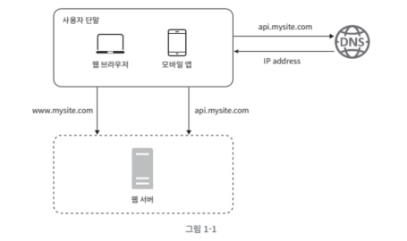

# 1장 사용자 수에 따른 규모 확장성

# 단일 서버




## 사용자 요청 처리 흐름

1. 사용자: 도메인 이름을 이용해서 웹사이트 접속
    - 도메인 이름 서비스 (Domain Name Service, DNS)에 질의하여 IP 주소로 변환하는 과정이 필요
    - DNS는 제 3 사업자가 제공하는 유료 서비스를 이용 (시스템의 일부는 아님)
2. DNS 조회 결과로 IP 주소가 반환
    - 여기서 반환된 IP 주소가 웹 서버의 주소
3. 웹 서버의 주소로 HTTP(HyperText Transfer Protocol) 요청이 전달됨.
    - HyperText Transfer Protocol:
        - 클라이언트(예: 웹 브라우저)가 서버에게 정보를 요청하는 프로토콜
        - 웹 페이지를 불러오거나 데이터를 보내는 등의 작업을 수행할 때 사용

## 데이터베이스


- 사용자가 늘어날 경우, 여러 서버를 두어야 한다.
    1. 웹/모바일 트래픽 처리 용도 (웹 계층)
    2. 데이터베이스용 (데이터 계층)
- 웹 서비스의 사용자가 늘면 서버 하나로 충분하지 않는 이유가 뭔가요?
    1. 트래픽 증가: 응답 시간이 길어짐, 사용자 경험 저하
    2. 가용성: 여러 대의 서버를 사용하면 단일 서버의 장애로부터 복구할 수 있음.
    3. 확장성: 여러 대의 서버를 사용하여 리소스를 확장해서 자원 한계를 극복
    4. 지리적 분산:
    5. 서비스 중단: 서버의 CPU, 메모리, 디스크 I/O 등의 자원이 고갈, 네트워크 대역폭이 모자라게 되면, 서버와 클라이언트 간의 통신이 지연되거나 끊길 수 있음
        - 데이터의 양이 네트워크 대역폭(capacity)을 초과하여 처리되거나 전송되는 것
        - 대역폭은 **네트워크에서 동시에 처리할 수 있는 데이터의 양**을 나타내며, 일반적으로 초당 비트 수로 표현
- DB 서버를 따로 두는 이유
    - 데이터베이스 서버는 CPU, 메모리, 디스크 I/O 등의 리소스를 많이 사용하기 때문에, 분리해서 각각의 서버가 리소스를 공유하지 않고 독립적으로 사용
    - 데이터베이스는 중요한 정보를 저장하고 있으므로, 데이터베이스 서버를 웹 서버와 분리하여 보안을 강화
    - 데이터베이스 서버에 직접적인 외부 접근을 제한하고, 웹 서버를 통해 간접적으로만 데이터베이스에 접근하도록 설정
    - 각각의 서버를 독립적으로 업그레이드하고 관리 → 유지 보수 작업을 효율적으로 수행할 수 있게 해주며, 서버 간의 종속성을 줄여줌

### 어떤 데이터베이스를 사용할 것인가?

- 관계형 데이터베이스 (Relational Database Management System, RDBMS)
    - MySQL
    - 테이블과 열, 칼럼으로 효현
    - 조인 연산을 지원
- 비 관계형 데이터베이스 (NoSQL)
    - Neo4j, 등
    - 조인 연산 x
- 비 관계형 데이터베이스를 선택할 고려 사항:
    1. 아주 낮은 응답 지연시간이 요구됨
        - NoSQL 데이터베이스는 수평적으로 확장이 가능 (스케일 아웃 방식)
        - 분산 데이터베이스 클러스터링을 통해 데이터를 여러 서버에 분산하여 처리할 수 있음. 이는 응답 지연시간을 줄이고 처리량을 증가시킴
        - 조인 연산이 필요 없어서 데이터 검색 시간이 단축됨
    2. 다루는 데이터가 비정형이라 관계형 데이터가 아님.
    3. 데이터(JSON, YAML, XML 등)를 직렬화하거나 (serialize) 역직렬화할 수 있기만 하면 됨
    4. 아주 많은 양의 데이터를 저장할 필요가 있음.

## 수직적 규모 확장 vs 수평적 규모 확장

- 수직적 규모 확장 (vertical scaling, scale up)
    - 서버에 고사양 자원(더 좋은 CPU, 더 좋은 RAM 등)을 추가하는 행위
- 수평적 규모 확장 (scale out)
    - 더 많은 서버를 추가하여 성능을 개선하는 행위
- 수직적 규모 확장의 단점:
    1. 한계가 있음. 한 대의 서버에 CPU나 메모리를 무한대로 증설할 방법은 없음.
    2. 장애에 대한 자동복구(failover)나 다중화(redundancy) 방안을 제시하지 않음. → 서버에 장애가 발생하면 웹사이트/앱은 완전히 중단됨.
- **대규모 앱을 지원하는 데는 수평적 규모 확장법이 적절하다.**

## 로드밸런서

- 로드밸런서:
    - 부하 분산 집합 (load balancing set)에 속한 웹 서버들에게 트래픽 부하를 고르게 분산하는 역할
    - 부하 분산 집합 (load balancing set): 로드 밸런서가 관리하는 서버 그룹, 동일한 서비스를 제공하기 위해 동일한 구성 및 기능을 갖춘 여러 대의 서버로 구성
- 사용자(클라이언트)는 로드밸런서의 공개 IP 주소로 접속함. (웹 서버는 클라이언트의 접속을 직접 처리하지 않는다.)
    
    ```python
    from fastapi import FastAPI, HTTPException
    from typing import Optional
    import random
    import requests
    
    app = FastAPI()
    
    # 서버 목록 및 IP 주소
    servers = {
        "Server1": "192.168.0.1",
        "Server2": "192.168.0.2"
    }
    
    # 클라이언트 요청을 처리하는 엔드포인트
    @app.get("/process_request/")
    async def process_request(client_id: str, data: Optional[str] = None):
        # 로드 밸런서에 연결된 서버 중 랜덤하게 선택
        selected_server = random.choice(list(servers.keys()))
        server_ip = servers[selected_server]
        
        # 선택된 서버에 클라이언트 요청 전달
        try:
            # 클라이언트 요청을 선택된 서버에 전송
            response = requests.get(f"http://{server_ip}/handle_request/?client_id={client_id}&data={data}")
            
            # 선택된 서버의 응답을 반환
            return {"message": f"Client {client_id}'s request processed by {selected_server}", "data": response.json()}
        except Exception as e:
            # 요청 전달에 실패한 경우 예외 처리
            raise HTTPException(status_code=500, detail=f"Error processing request: {str(e)}")
    ```
    
    - 로드밸런서 아주 단순한 구현
- 서버 간 통신:
    - 사설 IP 주소(private IP address)가 이용됨. (개인 또는 조직 내부의 로컬 네트워크에서 사용)
    - 사설 IP 주소는 같은 네트워크에 속한 서버 사이의 통신에만 쓰일 수 있는 IP 주소
    - 인터넷을 통해서는 접속할 수 없음.
- 로드밸러서의 장점:
    1. 장애를 자동복구하지 못하는 문제 해소
    2. 가용성 증가
- 트래픽 나누기 (웹 사이트 전체가 다운되는 일 방지)
- 트래픽이 너무 많아질 경우:
    - 로드밸러서를 통해 서버를 추가하기만 해서 트래픽 대처 가능
    - 로드밸런서가 자동적으로 트래픽을 분산시킴

## 데이터베이스 다중화


- 데이터베이스 서버는 주(master) - 부(slave) 관계를 설정하고 데이터 원본은 본 서버에, 사본은 부 서버에 저장
- 쓰기 연산:
    - 마스터에서만 지원
    - insert, delete, update 등
- 읽기 연산:
    - 부 DB가 주 DB로부터 사본을 전달받아서 읽기 연산을 수행
    - 대부분의 앱은 읽기 연산의 비중이 쓰기 연산보다 훨씬 높음.
    - 따라서 보통 부 DB가 더 많음.
- 데이터베이스 다중화의 이점:
    1. 더 나은 성능: 읽기 연산을 분산 처리해서, 병렬 처리 쿼리 개수 증가해서 성능이 좋아짐.
    2. 안정성: 자연 재해 등의 이유로 DB 서버 가운데 일부가 파괴되어도 데이터는 보존, 데이터를 지역적으로 다중화해서.
    3. 가용성: 데이터를 여러 지역에 복제해서, 하나의 DB 서버에 장애가 발생해도 다른 서버에 있는 데이터를 가져와 계속 서비스할 수 있게 됨.
- DB 서버가 하나 다운될 경우:
    1. 부 서버가 한 대뿐일 때, 부 서버가 하나 다운된 경우
        - 읽기 연산을 주 서버가 담당
    2. 부 서버가 여러 대일 때, 부 서버가 하나 다운된 경우
        - 읽기 연산은 나머지 부 서버들로 분산됨.
        - 새로운 부 서버가 장애 서버를 대체
    3. 부 서버가 한 대뿐일 때, 주 서버가 하나 다운된 경우
        - 부 서버가 새로운 주 서버가 되어서 모든 DB 연산을 일시적으로 수행

### 로드밸런서와 데이터베이스 다중화를 고려한 설계안


- 시스템 동작 방식:
    - 사용자는 DNS로부터 로드밸런서의 공개 IP 주소를 받는다.
    - 사용자는 해당 IP 주소를 사용해 로드밸런서에 접속한다.
    - HTTP 요청은 서버 1이나 서버 2로 전달된다.
    - 읽기 연산 - 웹 서버는 사용자의 데이터를 부 서버에서 읽는다.
    - 쓰기 연산 - 웹 서버는 데이터 변경 연산은 주 서버에서 수행한다. (insert, delete, update)

## 캐시

- 값비싼 연산 결과 또는 자주 참조되는 데이터를 메모리 안에 두고, 빨리 처리될 수 있도록 하는 저장소
- 애플리케이션의 성능은 데이터베이스를 얼마나 자주 호출하느냐에 크게 좌우 됨

### 캐시 계층


- 캐시 계층 (cache tier):
    - 데이터가 잠시 보관되는 곳으로 DB보다 훨 빠름.
    - 성능 개선 및 DB 부하 감소
    - 규모를 독립적으로 확장 가능
- 데이터를 웹 서버에 요청할 때: (읽기 주도형 캐시 전략)
    1. 데이터가 캐시에 있는 경우
        - 캐시에서 데이터를 읽어서 반환
    2. 데이터가 캐시에 없는 경우
        - DB에 쿼리해서 데이터를 찾아서 캐시에 저장
        - 캐시에 저장된 데이터를 클라이언트에 반환
    - 다양한 캐시 전략이 존재함

### 캐시 사용 시 유의할 점:

- 캐시를 고려하는 경우:
    - 데이터 갱신(write)는 자주 일어나지 않음
    - but,  참조(read)는 자주 발생
- 캐시에 저장해야할 데이터:
    - 캐시는 휘발성 메모리이므로, 서버가 재시작되면 캐시 내의 모든 데이터가 사라짐.
    - 중요하고 영속적으로 보관할 데이터는 저장소에 둔다.
- 캐시에 보관된 데이터를 만료시키기:
    - 만료시킬 정책을 마련해야 함.
    - 만료 정책이 없으면 데이터가 캐시에 계속 남음.
    - 만료 기한이 너무 짧으면, 캐시에 접근할 때 데이터가 저장되어 있지 않는 경우가 많아져서, DB read가 자주 발생한다.
    - 만료 기한이 너무 길면, 원본과 차이가 날 가능성이 높아짐.
- 일관성 유지:
    - 데이터 저장소의 원본과 캐시 내의 사본이 같은지 여부
    - 저장소 원본을 갱신하는 연산과 캐시를 갱신하는 연산은 단일 트랜잭션으로 처리되어야 함.
        - 일관성이 깨지면 안되기 때문에
    - 여러 지역에 걸쳐 시스템을 확장해 나가는 경우 캐시와 저장소 사이의 일관성을 유지하는 것은 어려운 문제가 됨.
- 장애 대처:
    - 캐시 서버를 하나만 둘 경우: 해당 서버는 단일 장애 지점(Single Point of Failure, SPOF)이 되어버릴 가능성이 있음.
    - 단일 장애 지점(Single Point of Failure, SPOF):
        - 어떤 특정 지점에서의 장애가 전체 시스템의 동작을 중단시켜버릴 수 있는 지점
    - SPOF를 피하려면 여러 지역에 걸쳐 캐시 서버를 분산시켜야 한다.
- 캐시 메모리의 크기:
    - 캐시 메모리가 너무 작을 경우:
        - 데이터가 자주 캐시에서 밀려나버릴 수 있음(eviction). 따라서 캐시 성능이 감소함.
    - 캐시 메모리를 키워서 해결: (과할당, overprovision)
        - 캐시에 보관될 데이터가 갑자기 늘어났을 때 생길 문제를 방지
- 데이터 방출(eviction) 정책:
    - 캐시가 꽉 차버리면, 기존 데이터를 내보내서 새 데이터를 추가해야 함.
    - LRU (Least Recently Used) 정책이 대표적. - 사용 시점이 가장 오래된 데이터를 내보내는 정책
    - LFU (Least Frequently Used) - 사용 빈도가 가장 낮은 데이터를 내보내는 정책
    - FIFO (First In First Out) - 가장 먼저 캐시에 들어온 데이터를 가장 먼저 내보내는 정책

## 콘텐츠 전송 네트워크 (CDN)

- CDN:
    - 정적 콘텐츠를 전송하는 데 쓰이는, 지리적으로 분산된 서버의 네트워크
    - 비디오, 이미지, CSS, JavaScript 파일 등을 캐시할 수 있음.
- CDN 동작 방식:
    
    
    
    - 어떤 사용자가 웹사이트 방문: 사용자에게 가장 가까운 CDN 서버가 정적 콘텐츠를 전달함. (사용자가 CDN 서버로부터 멀수록 천천히 로드됨)
- CDN 동작 과정 예시:
    
    
    
    1. 사용자 A가 이미지 URL을 이용해서 image.png에 접근
        
        
        
        - URL 도메인은 CDN에서 제공
    2. CDN 서버의 캐시에 해당 이미지가 없는 경우:
        - 서버는 원본(origin) 서버에 요청해서 파일 가져옴
    3. 원본 서버가 파일을 CDN 서버에 반환 (캐시 가능 시간인 TTL 값이 HTTP 헤더에 포함)
    4. CDN 서버는 파일을 캐시하고 사용자 A에게 반환 (이미지는 TTL에 명시된 시간이 끝날 때까지 캐시)
    5. 사용자 B가 같은 이미지에 대한 요청을 CDN 서버에 전송
    6. 만료되지 않은 이미지에 대한 요청은 캐시를 통해 처리

### CDN 사용 시 고려해야 할 사항

- 비용:
    - CDN은 제3 사업자(third-party providers)에 의해 운영됨. CDN으로 데이터를 전송하고 받은 만큼 요금을 지불함.
    - 자주 사용되지 않은 콘텐츠는 캐싱하는 것이 이득이 작으므로, CDN에서 제외
- 적절한 만료 시한 설정:
    - 시의성이 중요한(time-sensitive) 콘텐츠는 만료 시점을 잘 정해야 함.
    - 너무 길 경우:
        - 콘텐츠의 신선도가 떨어짐
    - 너무 짧을 경우:
        - 원본 서버에 빈번히 접속
- CDN 장애에 대한 대처 방안:
    - CDN 자체가 죽을 경우, 원본 서버로부터 직접 콘텐츠를 가져오도록 클라이언트를 구성해야 할 수도
- 콘텐츠 무효화 방법:
    - CDN 서비스 사업자가 제공하는 API를 이용하여 콘텐츠 무효화
    - 콘텐츠에 버전을 두기 (object versioning) ex: image.png?v=2


1. 정적 콘텐츠(JS, CSS, 이미지 등)은 더 이상 웹 서버를 통해 서비스하지 않음.
    - CDN을 통해 제공해서 더 나은 성능을 보장
2. 캐시가 DB 부하를 줄여줌.

## 무상태(stateless) 웹 계층

- 웹 계층을 수평적으로 확장하기 위해서:
    - 상태 정보(사용자 세션 데이터)를 웹 계층에서 제거해야 함
    - 서버 간에 세션 상태를 동기화할 필요가 없어지기 때문 = 상태 비저장 웹 서버는 각 요청을 독립적으로 처리할 수 있음
    - 사용자 세션이 특정 서버에 묶이지 않습니다. 이는 사용자 경험의 일관성을 유지하고, 서버의 장애가 발생했을 때 세션 손실의 위험을 줄임
    - 서버 간의 세션 정보 동기화 없이도, 모든 서버가 공통된 세션 저장소에 액세스 가능

### 상태 정보 의존적인 아키텍처


- 사용자 정보가 없는 서버로 요청이 갈 시, 인증이 실패하게 됨.
- 같은 클라이언트로부터의 요청은 항상 같은 서버로 전송되어야 함.
- 세션 정보가 필요한 경우:
    - 인증 및 사용자 관리, 장바구니 및 결제 정보, 사용자 상태 및 활동 추적

### 무상태 아키텍처


- 사용자로부터의 HTTP 요청은 어떤 웹 서버로도 전달될 수 있음.
- 웹 서버는 상태 정보가 필요한 경우: 공유 저장소로부터 가져옴.
    - 상태 정보가 웹 서버로부터 물리적으로 분리되어 있음.
    - 단순하고 안정적이고 규모 확장이 쉬움. **(왜냐면 웹 서버를 늘리기만하고, 사용자 정보가 추가된 서버에 의존적이지 않기 때문)**


- 세션 데이터를 웹 계층에서 분리함.
    - 공유 저장소에 보관함
    - 공유 저장소는 RDB, Redis 같은 캐시 시스템, NoSQL 일 수 있음.
- 자동 규모 확장(autoscaling):
    - 트래픽 양에 따라 웹 서버를 자동으로 추가하거나 삭제하는 기능
    - 상태 정보가 웹 서버들로부터 제거되었으므로, 트래픽 양에 따라 웹 서버를 넣거나 빼기만 하면 자동으로 규모를 확장 가능

## 데이터 센터


- 지리적 라우팅 (geoDNS-routing, geo-routing)
    - 사용자가 가장 가까운 데이터 센터로 안내되는 절차
    - 사용자의 위치에 따라 도메인 이름을 어떤 IP 주소로 변환할지 결정할 수 있도록 해 주는 DNS 서비스
- 데이터 센터 한 곳에 장애가 발생하면, 모든 트래픽은 장애가 없는 데이터 센터로 전송됨.
    
    
    

### 다중 데이터센터 아키텍처를 만들기 위해 해결할 기술적 난제:

- 트래픽 우회:
    - 올바른 데이터 센터로 트래픽을 보내는 효과적인 방법을 찾아야 함.
    - GeoDNS는 사용자에게서 가장 가까운 데이터센터로 트래픽을 보낼 수 있도록 함.
- 데이터 동기화
    - 데이터 센터마다 별도의 데이터베이스를 사용할 경우, 장애가 자동 복구되어 트래픽이 다른 데이터베이스로 우회해도 해당 데이터센터에는 찾는 데이터가 없을 수 있음.
    - 이를 막기 위해, 데이터를 여러 데이터센터에 걸쳐 다중화해야함.
- 테스트와 배포
    - 여러 데이터 센터를 사용하도록 시스템이 구성되어 있다면, 여러 위치에서 테스트를 해봐야 함.
- 시스템이 더 큰 규모로 확장하기 위해:
    - 시스템의 컴포넌트를 분리
    - 시스템의 컴포넌트가 각기 독립적으로 확장될 수 있도록 해야 함.

## 메시지 큐

- 메시지 큐:
    - 메시지의 무손실을 보장하는 비동기 통신을 지원하는 컴포넌트
- 메시지의 무손실(durability):
    - 메시지 큐에 일단 보관된 메시지는 소비자가 꺼낼 때까지 안전히 보관된다는 특성
- 비동기 통신:
    - 데이터를 보내는 측과 받는 측이 동시에 작업을 수행하지 않고, 데이터를 보내는 측이 데이터를 보내면 바로 작업을 진행하지 않고 대기하거나 다른 작업을 수행하는 동안, 받는 측은 데이터가 도착할 때까지 대기하지 않고 다른 작업을 수행하는 것을 의미
    - 동시에 작업을 수행하지 않아도 되므로 시스템이 보다 효율적으로 자원을 활용


- 생산자(발행자):
    - 메시지를 만들어 메시지 큐에 발행(publish)
- 소비자(구독자):
    - 서비스 혹은 서버
    - 메시지를 받아 그에 맞는 동작을 수행

### 메시지 큐 장점

- 서비스 또는 서버 간 결합이 느슨해짐:
    - 규모 확장성이 보장되어야 하는 안정적 애플리케이션을 구성하기 좋음
    - 소비자가 다운되어도 메시지를 발행할 수 있음.
    - 생산자가 다운되어도 메시지를 수신할 수 있음.
- 사용 예시: 사진 보정 애플리케이션
    
    
    
    - cropping, sharpening, blurring → 시간이 오래 걸리는 프로세스
    - 비동기적으로 처리
- 큐의 크기가 커지면:
    - 작업 프로세스를 늘려서 처리 시간을 줄인다.
- 큐가 거의 비어 있으면:
    - 작업 프로세스를 줄인다

### 로그, 메트릭, 그리고 자동화

- 로그:
    - 시스템의 오류와 문제들을 쉽게 찾기 위해 필요
    - 에러 로그 모니터링 해야함
    - 로그를 단일 서비스로 모아주는 도구를 활용
- 메트릭:
    - 사업 현황에 관한 정보 획득, 시스템 상태 파악
    - 호스트 단위 메트릭:
        - CPU, 메모리, 디스크 I/O
    - 종합 메트릭:
        - 데이터베이스 계층의 성능, 캐시 계층의 성능
    - 핵심 비즈니스 메트릭
        - 일별 활성 유저, 수익, 재방문(retention)
- 자동화:
    - CI (지속적 통합)
    - 개발자 코드의 자동 검증
    - 빌드, 테스트, 배포
    - 개발 생산성 향상

### 메시지, 큐, 로그, 자동화 등을 반영하여 수정한 설계안


- 메시지 큐: 각 컴포넌트가 보다 느슨히 결합될 수 있도록 함, 결함에 대한 내성 높임
- 로그, 메트릭, 모니터링, 자동화 장치 추가

## 데이터베이스의 규모 확장


- 저장할 데이터가 많아지면 DB 부하가 증가해서 DB를 증설해야 함.

### 수직적 확장 (스케일 업)

- 기존 서버에 더 많은 또는 고성능의 자원을 증설하는 방법
- stackoverflow는 천만 명의 사용자를 한 대의 마스터 DB로 처리했음
- 단점:
    1. 자원을 무제한 증설 불가능 → 결국 한계 존재
    2. SPOF(Single Point of Failure) 위험성
    3. 비용이 많이 듦. 고성능 서버로 갈수록 가격이 증가

### 수평적 확장 (sharding)

- 더 많은 서버 추가
- sharding:
    
    
    
    - DB를 shard라는 작은 단위로 분할하는 기술
    - 모든 shard는 같은 스키마를 사용 but 데이터 간 중복이 없음
- sharding 키를 정할 때, 데이터를 고르게 분할 할 수 있도록 해야함.

### sharding의 문제:

- 데이터의 재샤딩(resharding):
    - 샤드가 부족할 때 or 샤드 한 쪽이 빨리 공간 소모될 때
    - 샤드 키를 계산하는 함수를 변경하고 데이터를 재배치
- celebrity 문제
    - 특정 샤드에 질의가 집중되어 서버에 과부하가 걸리는 문제
    - 유명인 DB가 특정 샤드에 집중되서 read 연산이 많아지면서 과부하 발생
- join and de-normalization
    - 여러 샤드에 걸친 데이터를 조인하기 어려움
    - DB를 비정규화
    - 비정규화:
        - 데이터를 중복 저장하거나 여러 테이블을 하나의 테이블로 합치는 등의 방식으로 데이터 모델을 설계하는 것을 의미


## 백만 사용자, 그리고 그 이상

- 시스템 규모 확장을 위해 살펴본 기법들:
    - 웹 계층은 무상태 계층으로
        - 사용자 세션 정보는 공유 저장소를 통해 접근하자.
    - 모든 계층에 다중화 도입
        - 어느 한 쪽에 장애가 발생해도 대처할 수 있도록 하자.
    - 가능한 한 많은 데이터를 캐시할 것
        - 자주 참조되는 데이터들은 빨리 처리할 수 있도록 캐시에 데이터를 저장하자.
    - 여러 데이터 센터를 지원할 것
        - 장애가 있는 데이터 센터를 방지
    - 정적 콘텐츠는 CDN을 통해 서비스할 것
        - 자주 활용하는 정적 콘텐츠를 빨리 보기 위함
    - 데이터 계층은 샤딩을 통해 그 규모를 확장할 것
        - 샤딩을 통해 DB를 여러 서버에 분할해서 저장 가능
    - 각 계층은 독립적 서비스로 분할할 것
        - 메시지를 주는 쪽과 받는 쪽을 분리하면, 어느 한 쪽이 분리되어도 어느 한 쪽은 정상 기능하도록 하자
    - 시스템을 지속적으로 모니터링하고, 자동화 도구들을 활용할 것
        - 대규모 시스템을 위해 필요한 것들