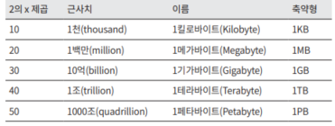

# 2장 개략적인 규모 추정

# 개략적인 규모 추정

- 시스템 설계 면접:
    - 시스템 용량이나 성능 요구사항을 개략적으로 추정해보라고 요구하기도 함
- 개략적인 규모 추정(back-of-the-envelope estimation):
    - 보편적으로 통용되는 성능 수치상에서 사고 실험을 행하여 추정치를 계산하는 행위
    - 어떤 설계가 요구사항에 부합할 것인지를 보기 위함.

## 2의 제곱수

- 데이터 양에 대한 계산법
- 1바이트 = 8비트 = ASCII 문자 하나
    
    
    
    - $2^{30}=1GB$

## 모든 프로그래머가 알아야 하는 응답지연 값

- 캐시 접근 > 메모리 접근 >>> 디스크 접근 순으로 빠르다
- 디스크 접근은 매우 느리다. 따라서 디스크 접근을 최소화해야 이유
    
    
    
- CPU는 높은 속도로 작동하는데, 디스크 I/O가 병목 현상을 일으키면 CPU는 자원을 낭비하며 I/O 작업의 완료를 기다려야 해서, 전체 시스템의 효율성을 저하시킴.
- 데이터 압축은 빠르다
- 데이터 크기가 클수록 전송이 느려지기 때문에, 압축해서 데이터를 최소화하고 난 후 전송하는 것이 필요하다.
- 데이터 센터가 멀수록 오래 걸린다.

## 가용성에 관계된 수치들

- 고가용성 (high availability):
    - 시스템이 오랜 시간 동안 지속적으로 중단 없이 운영될 수 있는 능력
    - percent로 표현함.
    - 100%는 단 한 번도 중단된 적이 없음을 의미함.
    - 99%~100% 사이의 값을 가짐.
- SLA (Service Level Agreement):
    - 서비스 사업자 (service provider)와 고객 사이에 맺어진 합의
    - 서비스 사업자가 제공하는 서비스의 가용시간(uptime)이 공식적으로 기술되어 있음.
    
    
    
    - 일간, 주간, 월간, 연간 각각에 대해 얼마나 오랜 시간 동안 시스템이 작동하지 않는지를 나타내는 차트
    - 가용률이 높을수록 서비스 신뢰성이 좋아짐.

## 예제: 트위터 QPS와 저장소 요구량 추정

**QPS(Query Per Second)** **추정**

- DAU(일간 능동 사용자) = MAU(월간 능동 사용자) * 50% = 1.5억 명
    - 하루에 월간 활성 이용자의 절반만큼이 사용한다고 가정
- QPS(Query Per Second) = 1.5억 * 2 트윗 / 24시간 / 3600초 = 약 3500
    - 하루에 모든 사람들이 평균 2개의 트윗을 사용한다고 가정
- 최대 QPS (Peek QPS) = 2 * QPS = 약 7000
    - 쿼리가 급증할 때 2배 정도의 쿼리가 발생한다고 가정

**미디어 저장을 위한 저장소 요구량**

- 평균 트윗 크기 가정:
    - tweet_id: 64바이트
    - 텍스트: 140바이트
    - 미디어: 1MB
- 일간 미디어 저장소 요구량:
    - 1.5억 * 2 * 10% * 1MB = 3천만 MB / 일 = 3*10^7 * 10^6 MB / 일 = 3*10^12 * 10 / 일 = 3 * 10 TB / 일
- 5년간 미디어 보관하기 위한 저장소 요구량:
    - 30 TB * 365 * 5 = 55PB

# 팁

- 개략적인 규모 추정과 관계된 면접에서 가장 중요한 것은 문제를 풀어 나가는 절차
- 올바른 절차가 결과를 내는 것보다 중요함.
- **문제 해결 능력**을 보고자 함.
- 근사치를 활용한 계산(rounding and approximation):
    - 복잡한 계산하지 말고 적절한 근사치를 활용하자.
    - ex: 99987/9.1 →100000/10
- 가정 (assumption)은 메모하자.
- 단위를 붙이자. (MB, KB)
- 빈출 유형:
    - QPS, 최대 QPS, 저장소 요구량, 캐시 요구량, 서버 수 추정