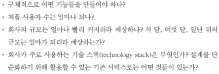

# 3장 시스템 설계 면접 공략법

# 시스템 설계 면접 공략법

- 문제가 막연하기도 해서 당황스럽다. ex: 유명한 앱인 X를 설계해라.
- 질문이 모호하고 범위도 지나치게 넓음
- 그러나 큰 요구를 하는 것이 아님.
- 시스템 설계 면접:
    - 두 명의 동료가 모호한 문제를 풀기 위해 협력하여 그 해결책을 찾아내는 과정에 대한 시뮬레이션
    - 정해진 결말도 정답도 없다. 최종 설계안보다 중요한 것은 설계 과정
    - 보유한 설계 기술을 시연하는 자리
    - 설계 과정에서 내린 결정들에 대한 방어 능력을 보이는 자리
    - 면접과의 피드백을 건설적인 방식으로 처리할 자질이 있음을 보이는 자리
- 시스템 설계 면접에서 면접관이 찾고자 하는 것:
    - 설계 능력의 기술적 측면
    - 지원자가 협력에 적합한 사람인지
    - 압박이 심한 상황도 잘 헤쳐 나갈 자질이 있는지
    - 모호한 문제를 건설적으로 해결할 능력이 있는지
    - 좋은 질문을 던질 능력이 있는지
- 부정적 신호 (red flag):
    - 설계의 순수성에 집착해서 타협적 결정(tradeoff)를 도외시하고 over-engineering 수행
    - 과도한 엔지니어링의 결과로 시스템 전반의 비용이 증가함
    - 완고함, 편협함

## 효과적 면접을 위한 4단계 접근법

### 1단계: 문제 이해 및 설계 범위 확정

- 시스템 설계 면접을 볼 때는 생각 없이 답을 내서는 안됨.
- 요구사항을 완전히 이해하고 답을 내놓아야 함.
- 정답은 없다!
- 깊이 생각하고 질문하면서 요구사항과 가정들을 명확히 하자
- 올바른 질문, 적절한 가정, 시스템 구축에 필요한 정보들을 모으면서 시스템 요구사항을 명확히 이해하자
- 요구사항을 정확히 이해하는 데 필요한 질문들:
    
    
    

**예제: 뉴스 피드(news feed) 시스템 설계**

- 요구사항을 이해하고 모호함을 없애자

### 2단계: 개략적인 설계안 제시 및 동의 구하기

- 면접관을 팀원인 것처럼 대하고 대화하면서 제안한 최초 청사진에 대해 의견을 구하자
- 따로 핵심 컴포넌트를 포함하는 다이어그램을 그리자.
- 최초 설계안이 시스템 규모에 관계된 제약사항들을 만족하는지 개략적으로 계산하자. (계산 과정은 소리 내어 설명)

### 3단계: 상세 설계

- 면접관과 함께 설계할 컴포넌트 사이의 우선순위를 정하기.
- 우선순위가 높은 특정 컴포넌트의 세부사항을 깊이 있게 설명하기
- 시간 관리 주의 - 불필요한 세부사항에 시간을 쓰지 말자.

### 4단계: 마무리

- 설계 결과물에 관련된 몇 가지 후속 질문을 던질 수 있음.
- 개선할 점을 요구하면 없다고 하지 말고, 찾도록 하자.
- 설계를 다시 요약해주는 것도 좋다. 이를 통해 면접관의 기억을 환기시켜주자
- 요류가 발생하면 어떤 일이 발생할지 이야기해보는 것
- 운영은 어떻게 할지 (ex: 메트릭 수집, 모니터링 방법, 로그 기록, 배포 어떻게 할지)
- 서비스 규모가 커지는 것을 어떻게 대처할지

### 면접 중 해야할 것:

- 질문을 통해 모호함을 없애자. 스스로 내린 가정이 옳다고 믿지 말고 물어보자.
- 문제의 요구사항을 이해하자.
- 가능하면 여러 해법을 함께 제시하자
- 가장 중요한 컴포넌트부터 시작해서 세부사항을 설명하자.
- 면접관의 아이디어를 이끌어 내자

### 하지 말아야 할 것:

- 요구사항이나 가정들을 분명히 하지 않은 상태에서 설계를 제시하는 것
- 개략적인 설계 없이 세부사항을 깊이 설명하는 것
- 막혔을 때 물어보지 않는 것 → 힌트를 요청하자

### 시간 배분

