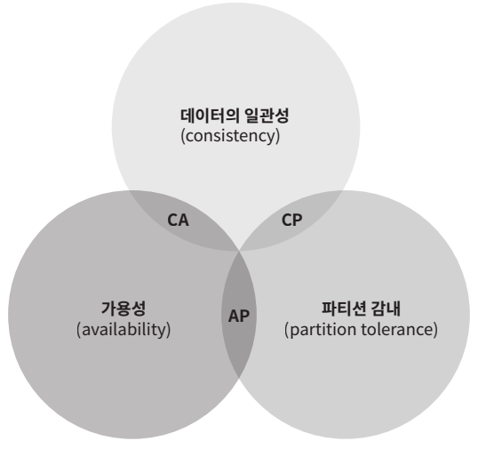

# 6장 키-값 저장소 설계

# 문제 이해 및 설계 범위 확정

- 다음 연산을 지원하는 키-값 저장소 설계:
    - put(key, value): 키-값 쌍을 저장소에 저장한다.
    - get(key): 인자로 주어진 키에 매달린 값을 꺼낸다.
- 요구 사항:
    - 키-값 쌍의 크기는 10KB 이하
    - 큰 데이터를 저장할 수 있어야 함.
    - 높은 가용성을 제공, 장애에도 빠른 응답을 요구
    - 높은 규모 확장성, 트래픽 양에 따라 자동적으로 서버 증설/삭제
    - 데이터 일관성 수준은 조정이 가능해야 함. (무슨 소리?)
    - 응답 지연시간(latency)가 짧아야 한다.

# 단일 서버 키-값 저장소

- 모든 키-값 쌍을 전부 메모리에 해시 테이블로 저장하기
- 메모리가 부족할 수 있음.
    - 데이터 압축
    - 자주 쓰이는 데이터만 메모리에 두고 나머지는 디스크에 저장
- 그러나 한 대 서버로는 부족 → 분산 키-값 저장소 (distributed key-value store)를 만들어야 함.

# 분산 키-값 저장소 (분산 해시 테이블)

## CAP 정리

- Consistency(데이터 일관성), Availability(가용성), Partition tolerance(파티션 감내) **세 요구사항을 동시에 만족하는 분산 시스템 설계는 불가능하다는 정리**
- Consistency(데이터 일관성):
    - 분산 시스템에 접속하는 모든 클라이언트는 어떤 노드에 접속했느냐에 관계없이 **언제나 같은 데이터를 보게 되어야 한다.**
- Availability(가용성):
    - 분산 시스템에 접속하는 클라이언트는 일부 노드에 장애가 발생하더라도 **항상 응답을 받을 수 있어야 한다.**
- Partition tolerance(파티션 감내):
    - 파티션: 두 노드 사이에 통신 장애가 발생하였음을 의미
    - 파티션 감내: 네트워크에 파티션이 생기더라도 **시스템은 계속 동작**하여야 한다는 의미

- 키-값 저장소는 세 요구사항 중 어느 2개를 만족하느냐에 따라 분류: CP, AP, CA 시스템
    - 세 요구사항 중 어느 하나를 희생
    - CA는 존재할 수 없음. 네트워크 장애는 반드시 발생하기 때문

### 이상적 상태

- 파티션 x
- 데이터가 자동적으로 복제됨 → 데이터의 일관성과 가용성도 만족

### 실세계의 분산 시스템

- 파티션 문제 발생 → 일관성과 가용성 중 하나 선택해야 함
- **시스템의 요구사항에 따라 CP와 AP 중에 선택해야 함. (면접관과 상의)**
- CP 시스템 - 일관성 선택:
    - n1 n2에 쓰기 연산 중단 → 데이터 불일치 문제 피함.
    - 가용성이 깨짐.
    - 은행권 시스템에서는 일관성이 필요
        - 계좌 최신 정보를 출력하지 못하는 상황 → 잘못된 거래 방지해야함
    - 파티션 문제가 해결될 때까지 오류를 반환
- AP 시스템 - 가용성 선택:
    - n1 n2에 쓰기 연산 허용 → n3는 낡은 데이터가 반환될 수 있음 (n1 n2의 write된 데이터가 n3에 복제가 안되서)
    - 낡은 데이터를 반환할 수 있어도, read 연산을 허용
    - 파티션 문제가 해결된 뒤 새 데이터를 n3에 전송

## 시스템 컴포넌트

- 키-값 저장소 구현에 사용될 핵심 컴포넌트들 및 기술들을 알아봄

### 데이터 파티션

- 데이터를 작은 파티션들로 분할 후 여러 서버에 저장해야 함.
- 데이터 파티션 단위로 나눌 때 고려 사항:
    - 데이터를 여러 서버에 고르게 분산할 수 있는가
    - 노드가 추가되거나 삭제될 때 데이터의 이동을 최소화할 수 있는가
- 안정 해시를 통해 고려 사항을 충족
- 안정 해시의 동작 원리:
    
    
    
    - key가 링을 시계 방향으로 순회하다가 만나는 첫 서버가 해당 키-값 쌍을 저장할 서버
- 안정 해시를 통해 데이터 파티션 시 장점:
    - 규모 확장 자동화(automatic scaling): 시스템 부하에 맞춰 서버가 자동으로 추가 or 삭제
    - 다양성(heterogeneity): 서버 용량에 맞춰 가상 노드 수 조절 = 고성능 서버는 더 많은 가상 노드를 설정

### 데이터 다중화

- 높은 가용성과 안정성 확보: 데이터를 N개 서버에 비동기적으로 다중화(replication)
- N개 서버 선정 방법:
    - 어떤 키를 링 위에 배치 후, 그 지점으로부터 시계 방향으로 만나는 첫 N개 서버에 데이터 사본을 보관
    - 가상 노드 사용 시 주의할 것: 선택한 N개 노드 중 실제 물리 서버의 개수가 N보다 작아질 수 있음. → 같은 물리 서버를 중복 선택하지 않도록 해야 함.
    - 다른 센터의 서버에 보관하도록 함: 같은 데이터 센터에 속한 노드는 여러 이슈를 동시에 겪을 수 있기 때문

### 데이터 일관성

- 여러 노드에 다중화된 데이터는 적절히 동기화 되어야 함.
- 정족수 합의 프토로콜(Quorum Consensus):
    - 읽기/쓰기 연산 모두에 일관성을 보장할 수 있음
    - N: 사본 개수
    - W: 쓰기 연산에 대한 정족수, 쓰기 연산 성공 = W개 서버로부터 쓰기 연산 성공 응답을 받으면 됨.
    - R: 읽기 연산에 대한 정족수, 읽기 연산 성공 = R개 서버로부터 읽기 연산 성공 응답을 받으면 됨.
- W=1 or R=1:
    - 한 대 서버로부터의 응답만 받으면 됨
    - 응답속도 빠름
- W>1 or R>1:
    - 데이터의 일관성 향상
    - 느린 서버 속도에 맞춰 응답속도 느려짐
- W+R > N:
    - 강한 일관성(strong consistency) 보장
    - 일관성을 보증할 최신 데이터를 가진 노드가 최소 하나 겹치기 때문

| R=1, W=N | 빠른 읽기 연산에 최적화된 시스템 |
| --- | --- |
| R=N, W=1 | 빠른 쓰기 연산에 최적화된 시스템 |
| W+R > N | 강한 일관성이 보장됨 (보통 N=3, W=R=2) |
| W+R ≤ N | 강한 일관성이 보장되지 않음. |
- 요구되는 일관성 수준에 따라 W, R, N 조정

### 일관성 모델

- 일관성의 수준을 결정
- 강한 일관성: 모든 읽기 연산은 가장 최근에 갱신된 결과를 반환한다. 클라이언트는 낡은 데이터를 보지 못함.
- 약한 일관성: 항상 가장 최신 결과를 반환받지 못할 수 있음.
- 최종 일관성: 약한 일관성의 일종, 갱신 결과가 모든 사본에 동기화되는 모델

### 비 일관성 해소 기법: 데이터 버저닝

- 데이터 다중화: 가용성은 증가 & 일관성 깨질 가능성 증가
- 데이터 버저닝: 데이터가 변경될 때 해당 데이터의 새로운 버전을 만드는 거 → 각 버전의 데이터는 변경 불가능(immutable)
- 동일 데이터에 대한 다른 서버에서의 다른 쓰기 연산 → 버전 충돌
- 벡터 시계(vector clock): [서버, 버전]의 순서쌍을 데이터에 매단 것 → 어떤 버전이 선행 버전인지, 후행 버전인지, 다른 버전과 충돌이 있는지 판별하는데 쓰인다.
    - 데이터의 버전 정보를 활용해서 클라이언트가 데이터 간 충돌을 파악할 수 있고 클라이언트가 해결함.
- 벡터 시계 단점:
    1. 클라이언트 구현이 복잡해짐.
    2. 순서쌍이 빠르게 늘어남. → 임계치 설정해서 해결 → 정확한 선후 관계 결정이 어려움. → 그러나 이로 인한 문제가 발생한 적은 없다?

### 장애 처리

- 불가피 및 흔한 일
- 장애 감지 기법
- 장애 해소 전략

### 장애 감지

- 두 대 이사의 서버가 동일하게 ‘서버 A가 죽었다’라는 장애를 보고해야 해당 서버에 장애가 발생했다고 간주함.
- 멀티캐스팅 채널 구축:
    - 서버 많으면 비효율적
- 가십 프로토콜:
    - 분산형 장애 감지 솔루션
    - 각 노드는 주기적으로 카운터 증가
    - 박동 카운터가 일정 시간 갱신되지 않으면 해당 서버는 장애(offline) 상태인 것으로 간주

### 일시적 장애 처리

- 장애 발생 시:
    - 엄격한 정족수 접근법: 읽기와 쓰기 연산을 금지
    - 느슨한 정족수 접근법: 장애 서버를 제외한 쓰기 연산을 수행할 서버와 읽기 연산을 수행할 서버를 해시 링에서 선택
- 느슨한 정족수 접근법:
    - 장애 서버로의 요청을 다른 서버가 잠시 맡아 처리
    - 그동안의 변경사항은 해당 서버가 복구되었을 때 일괄 반영해 데이터 일관성을 보존

### 영구 장애 처리

- 반-엔트로피 프로토콜: 사본 동기화
    - 사본들을 비교하여 최신 버전으로 갱신하는 과정 포함
    - 사본 간의 일관성이 망가진 상태를 탐지 및 전송 데이터의 양을 줄이기 휘애 머클 트리 사용
- 머클 트리:
    1. 버킷 속 데이터에 대해 해시 값 존재
    2. 버킷에 대한 해시 값 존재
    3. 버킷에 대한 해시 값을 2개씩 묶은 (이진 트리) 해시 값 존재
    4. 3번에 대해 반복 → 루트 노드가 서버의 노드
    - 두 데이터의 루트 노드의 해시 값이 일치하면 → 두 데이터는 같은 서버에 존재
    - 두 데이터의 루트 노드의 해시 값이 다르다면 → 두 데이터는 다른 서버에 존재 → 자식 노드를 계속 탐색해서 다른 데이터를 갖는 버킷을 발견해서 그 버킷들만 동기화
- 머클 트리 이용 시:
    - 서버 간 동기화할 데이터는, 데이터의 차이 크기에 비례함. 전체 데이터 크기에 비례하지 않음.

### 데이터 센터 장애 처리

- 데이터 센터 장애에 대응하려는 시스템: 데이터를 여러 데이터 센터에 다중화하는 것

## 시스템 아키텍처 다이어그램

- 클라이언트: get(key), put(key, value) 두 개 연산 수행
- 중재자: 클라이언트에게 키-값 저장소에 대한 proxy 역할
- 노드: 안정 해시의 해시 링 위에 분포
- 시스템의 분산 (decentralized): 노드를 자동적으로 추가 및 삭제를 가능하게 함
- 데이터가 여러 노드에 다중화됨
- **모든 노드가 같은 책임을 지므로 SPOF는 존재하지 않음 → ???**

## 쓰기 경로

- 카산드라의 사례
1. 쓰기 요청이 커밋 로그 파일에 기록
2. 데이터가 메모리 캐시에 기록
3. 메모리 캐시가 가득차거나 임계치 이상일 경우 → 데이터는 디스크의 SSTable에 기록됨.

## 읽기 경로

- 읽기 요청을 받은 서버: 데이터가 메모리 캐시에 있는지 확인
- 있는 경우: 해당 데이터 클라이언트에게 반환
- 없는 경우: 디스크에 가져옴 (어느 SSTable에 찾는 키가 있는지 알아내야 함 → Bloom Filter의 역할)

## 요약

| 목표/문제 | 기술 |
| --- | --- |
| 대규모 데이터 저장 | 안정 해시를 사용해 서버들에 부하 분산 |
| 읽기 연산에 대한 높은 가용성 보장 | 데이터를 여러 데이터 센터에 다중화 |
| 쓰기 연산에 대한 높은 가용성 보장 | 버저닝 및 벡터 시계를 사용한 충돌 해소 |
| 데이터 파티션 | 안정 해시 |
| 점진적 규모 확장 | 안정 해시 |
| 다양성 (heterogeneity) | 안정 해시 |
| 조절 가능한 데이터 일관성 | 정족수 합의 |
| 일시적 장애 처리 | 느슨한 정족수 & 단서 후 임시 위탁 |
| 데이터 센터 장애 대응 | 데이터를 여러 데이터 센터에 다중화 |