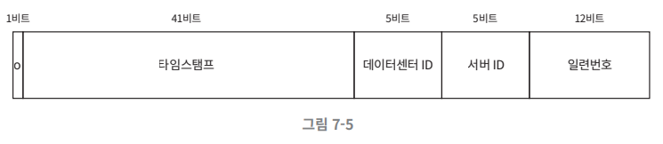

# 7장 분산 시스템을 위한 유일 ID 생성기 설계

# 1단계 문제 이해 및 설계 범위 확정

- 면접관과 질문을 통해 모호함을 없애고 설계 방향을 정한다.
- ID는 유일, 숫자로만 구성, 64비트 발급 날짜에 따라 정렬
- 초당 10000개 ID 생성 가능

# 2단계 개략적 설계안 제시 및 동의 구하기

## 다중 마스터 복제

- 데이터베이스의 auto_increment 기능 활용
    - ID는 현재 서버 개수 k개만큼 증가
- 데이터 센터에 걸쳐 규모를 늘리기 어려움
- ID 유일성은 보장, 값이 시간 흐름에 맞추어 커지도록 보장 안됨
- 서버를 추가 삭제에 잘 동작하도록 만들기 어려움

## UUID

- 컴퓨터 시스템에 저장되는 정보를 유일하게 식별하기 위한 128비트짜리 수
- 유일성은 보장
- 충돌 가능성이 지극히 낮다
- 웹 서버가 별도의 ID 생성기를 사용해 독립적으로 ID를 만들어 냄
- 장점:
    - 단순 → 서버 간 조율 불필요 → 동기화 이슈 없음
    - 각 서버가 각자 쓸 ID를 만들어서 규모 확장이 쉽다.
- 단점:
    - 요구사항인 64비트에 적합하지 않음
    - ID를 시간순으로 정렬 x
    - ID에 숫자가 아닌 값이 포함될 수 있음

## 티켓 서버

- 유일성 보장
- auto_increment 기능을 갖춘 DB 서버 = 티켓 서버를 중앙 집중형으로 하나만 사용
- 장점:
    - 유일성, 숫자 사용
    - 구현이 쉽고, 중소 규모 애플리케이션에 적합
- 단점:
    - 티켓 서버가 SPOF임.
    - 티켓 서버를 여러 개 둬서 SPOF를 해결하려고 하면 → 데이터 동기화 문제 발생

## 트위터 스노플레이크 접근법

- 이번 장의 요구 사항을 만족하는 ID 생성 기법

- 사인 비트
    - 1비트
    - 음수 양수 구분
- 타임스탬프
    - 41비트
    - 기원 시각 이후로 몇 밀리초 경과했는지의 값
- 데이터센터 ID
    - 5비트
    - $2^5$ = 32개 데이터센터 지원
- 서버 ID
    - 5비트
    - 32개 서버 사용 가능
- 일련번호
    - 12비트
    - 각 서버별로 ID 생성할 때 일련 번호 1만큼 증가
    - 1밀리초 경과할 때마다 0으로 초기화

# 3단계 상세 설계

- 데이터 센터 ID나 서버 ID 잘못 변경 시에 ID 충돌이 발생할 수 있음

## 타임스탬프

- 41비트, 시간 흐름에 따라 점점 큰 값을 가짐 → 시간 순 정렬 가능
- UTC 시각 추출 가능 → 반대로 UTC를 타임스탬프로 변경도 가능
- 69년 동안만 정상 작동하므로, 69년 지난 후에는 기원 시각을 바꾸거나 ID 체계를 다른 것으로 이전해야 함.

## 일련번호

- 12비트, 4096개 값을 가짐.
- 어떤 서버가 같은 밀리초 동안 하나 이상의 ID를 만들어 낸 경우에만 0보다 큰 값을 가지게 됨.

# 4단계 마무리

- 스노우플레이크 방식 채택: 모든 요구사항 만족 및 분산 환경에서 규모 확장이 가능
- 추가 논의
- 시계 동기화:
    - 이번 설계에는 서버들이 모두 같은 시계를 사용한다고 가정함.
    - 이 가정은 서버가 여러 코어에서 실행될 경우 유효하지 못할 수 있음.
    - NTP가 문제 해결 수단
- 각 절의 길이 최적화:
    - 동시성이 낮고 수명이 긴 애플리케이션은 일련번호 절의 길이를 줄이고
    - 타임스탬프 절의 길이를 늘리는 것이 효과적일 수 있음.
- 고가용성:
    - ID 생성기는 필수 불가결 컴포넌트임으로 아주 높은 가용성을 제공해야하 함.