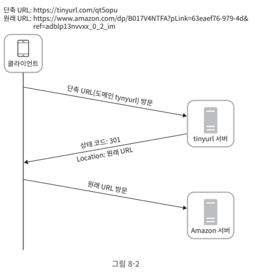

# 8장 URL 단축기 설계

# 1단계 문제 이해 및 설계 범위 확정

**요구사항 파악:**

- 단축 URL을 결과로 제공
- 원래 URL로 가야함: URL redirection
- 매일 1억 개 단축 URL 생성
- 단축 URL 짧을수록 좋음
- 숫자와 영문자(대소문자 구분)
- 단축된 URL 삭제 및 갱신 고려 X

**개략적 추정**

- 쓰기 연산: 매일 1억개
- 초당 쓰기 연산: 1억 / 24 / 3600 = 1160
- 읽기 연산: 쓰기 연산의 10배라고 가정 = 11600
- URL 단축 서비스 10년 운영 = 1억 * 365 * 10 = 3650억 레코드 보관 가능해야
- 축약 전 URL 평균 길이 100
- 10년 간 저장 용량: 3650억 * 100바이트 = 36.5 TB

# 2단계 개략적 설계안 제시 및 동의 구하기

## API 엔드포인트

- 클라이언트: 서버가 제공하는 API 엔드포인트를 통해 서버와 통신
1. URL 단축용 엔드포인트:
    - 엔드포인트에 단축할 URL을 인자로 실어서 POST 요청
        
        ```python
        POST /api/v1/data/shorten
        인자: {longUrl: longURLstring}
        반환: 단축 URL
        ```
        
2. URL 리디렉션용 엔드포인트
    - 단축 URL에 대한 HTTP 요청 시 원래 URL로 보내주기 위한 용도
        
        ```python
        GET /api/v1/shortUrl
        반환: HTTP 리디렉션 목적지가 될 원래 URL
        ```
        

## URL 리디렉션



- 단축 URL을 방문하면 원래 URL을 반환함.
- 301 Permanently Moved:
    - 브라우저는 캐시된 원래 URL로 요청을 보냄
    - 서버 부하 감소
- 302 Found:
    - 주어진 URL로 요청이 일시적으로 Location 헤더가 지정하는 URL에 의해 처리되어야 한다는 응답
    - 클라이언트 요청은 단축 URL 서버에 먼저 보내진 후 원래 URL로 리디렉션
    - 트래픽 분석 시 → 클릭 발생률 및 발생 위치 추적에 유리
- URL 리디렉션 구현: 해시 테이블 사용
    - `<단축 URL, 원래 URL>` 쌍
    - `원래 URL = hashTabel.get(단축 URL)`
    - 301 또는 302 응답 Location 헤더에 원래 URL을 넣은 후 전송

## URL 단축


- 긴 URL을 해시 값으로 대응시킬 해시 함수 fx를 찾아야 함
- 해시 함수의 요구 사항:
    - 입력에 따라 해시 값이 달라야함
    - 해시 값으로 원래 입력이 복원되야 함.

# 3단계 상세 설계

## 데이터 모델

- 해시 테이블: 실제 시스템에서는 곤란: 메모리는 유한하고 비쌈
- 더 나은 방법: `<단축 URL, 원래 URL>` 쌍을 RDB에 저장하는 것

## 해시 함수

- 해시 함수가 계산하는 단축 URL을 hashValue 라고 지칭하겠음.

### 해시 값 길이

- hashValue: [0-9, a-z, A-Z]의 문자들로 구성 = 62개
- hashValue의 길이 정하기: $62^n≥3650억$ 만족하는 n 찾기
    - n=7일 떄, 3.5조 개 URL 생성 가능
    - 요구사항 만족에 충분
    - hashValue 길이 = 7

### 해시 후 충돌 해소


- `CRS32` 와 같이 잘 알려진 해시 함수 사용하기 → 여전히 7보다 길다
    - 충돌이 해소될 때까지 사전에 정한 문자열을 해시값에 덧붙임 (문자열 추가)
- 한 번 이상 DB 질의해야 해서 오버헤드 큼

### base-62 변환

- URL 단축기 구현 시 흔히 사용됨
- 수의 표현 방식이 다른 두 시스템이 같은 수를 공유해야 하는 경우에 유용
    - CRC32 ↔ 길이가 7인 hashValue
- 문자 62개를 사용해서 62진법 사용

| 해시 후 충돌 해소 전략 | base-62 변환 |
| --- | --- |
| 단축 URL의 길이가 고정됨 | 단축 URL 길이 가변적, ID값이 커지면 같이 길어짐 |
| 유일성이 보장되는 ID생성기가 불필요 | 유일성 보장 ID 생성기가 필요 |
| 해소 전략 필요 | ID 유일성이 보장되므로, 충돌 불가능 |
| ID로부터 단축 URL을 계산하는 방식이 아니라서 다음 URL 파악 불가능 | ID가 1씩 증가한다면, 다음에 쓸 단축 URL이 무엇인지 쉽게 파악 가능 → 보안 문제 |

### URL 단축기 상세 설계

**URL 단축기의 처리 흐름에 대한 순서도**


1. 긴 URL 입력
2. URL 있는지 확인
3. 해당 URL에 대한 단축 URL 확인 → DB에서 찾은 URL 반환
4. DB에 없을 경우: 유일 ID 생성 (DB의 기본 키)
5. 62진법 변환을 적용, ID를 단축 URL로 만들기
6. `ID, 단축 URL, 원래 URL` → 레코드 만들어서 단축 URL을 클라이언트에 전달


- ID는 전역적 유일성이 보장되어야 함.
- 고도로 분산된 환경에서는 이것은 어려운 일이긴 함.

### URL 리디렉션 상세 설계


- `<단축 URL, 원래 URL>` 쌍을 캐시에 저장해서 성능 향상
- 로드밸러서의 동작 흐름:
    1. 사용자가 단축 URL 클릭
    2. 로드밸런서가 해당 클릭으로 발생한 요청을 웹 서버로 전달
    3. 단축 URL이 이미 캐시에 있는 경우: 원래 URL을 반환
    4. 캐시 x: DB에서 꺼냄. DB에 없다면 잘못된 단축 URL이 입력으로 들어온 경우
    5. 데이터베이스에서 꺼낸 URL을 캐시에 넣은 후 사용자에게 반환

# 4단계 마무리

- 추가로 이야기하면 좋을 것:
- 처리율 제한 장치: 엄청난 양의 URL 단축 요청에 취야함. 처리율 제한 장치를 통해 요청을 걸러내자.
- 웹 서버의 규모 확장: 웹 서버는 무상태 계층이므로 웹 서버 증설 및 삭제가 자유로움
- DB 규모 확장: DB 다중화 또는 샤딩
- 데이터 분석 솔루션: URL 단축기에 데이터 분석 솔루션을 통합 → 클릭 횟수, 빈번 클릭 시점 파악
- 가용성, 데이터 일관성, 안정성 고려하기