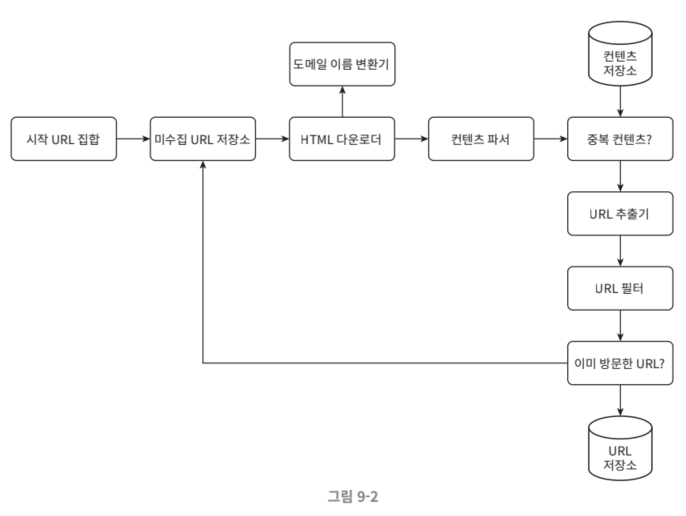

# 9장 웹 크롤러

# 9장 웹 크롤러

**크롤러의 이용**

- 검색 엔진 인덱싱: 웹 페이지를 모아 검색 엔진을 위한 로컬 인덱스를 만듦
- 웹 아카이빙: 나중 사용을 목적으로, 정보 장기 보관
- 웹 마이닝: 유용한 지식 추출
- 웹 모니터링: 저작권 침해 사례 모니터링

# 1단계 문제 이해 및 설계 범위 확정

- 요구사항 및 설계 범위:
    - 검색 엔진 인덱싱 용도
    - 매달 10억 개 웹 페이지 수집
    - 신규 웹 페이지도 수집
    - 수정된 웹 페이지도 수집
    - 5년간 저장
    - 중복 컨텐츠를 갖는 페이지 무시
- 질문을 통해 모호함 제거

**추가적인 고려**

- 규모 확장성:
    - 병렬성 활용
- 안정성:
    - 비정상적 입력 및 환경에 잘 대응
- 예절
    - 짧은 시간 동안 요청 적당히
- 확장성
    - 여러 형태의 콘텐츠(이미지, pdf 등) 고려한 시스템

## 개략적 규모 추정

- QPS = 10억 / 30일 / 24시간 / 3600초 = 400페이지 / sec
- Peak QPS = 2 * QPS = 800
- 웹 페이지 크기 평균 500k
- 10억 페이지 * 500k = 500TB / 월
- 5년 보관 용량 = 500TB * 12월 * 5년 = 30PB

# 2단계 개략적 설계안 제시 및 동의 구하기

## 시작 URL 집합

- 나라별, 주제별로 세분화해서 시작 URL 작성하듯이
- 의도에 맞게 시작 URL 작성

## 미수집 URL 저장소

- 현대적 웹 크롤러: FIFO 큐 사용
- 다운로드할 URL을 미수집 URL 저장소(URL frontier)에 저장

## HTML 다운로더

- 인터넷에서 웹 페이지를 다운로드하는 컴포넌트
- 다운로드할 페이지의 URL은 미수집 URL 저장소(URL frontier)이 담당

## 도메인 이름 변환기

- 도메인 이름 변환기 = URL을 IP주소로 변환
- HTML 다운로더는 도메인 이름 변화기를 사용해서 IP 주소 확인

## 콘텐츠 파서

- 이상한 웹 페이지 거르고, 저장 공간 낭비 방지
- 크롤링 서버 안에 콘텐츠 파서를 구현하면 크롤링 과정이 느려질 수 있음 → 독립된 컴포넌트로 구성

## 중복 콘첸츠인가?

- 자료 구조를 도입하여 데이터 중복을 방지 및 데이터 처리 소요 시간 줄임
- 웹 페이지의 해시 값을 비교

## 콘텐츠 저장소

- HTML 문서를 보관하는 시스템
- 저장소 구현 시 고려 사항:
    - 저장할 데이터의 유형
    - 저장할 데이터의 크기
    - 저장할 데이터의 저장소 접근 빈도
    - 데이터의 유효 기간
- 데이터의 양이 많음 → 대부분의 콘텐츠를 디스크에 저장
- 인기 콘텐츠 → 메모리에 두어 접근 지연시간을 줄임

## URL 추출기

- HTML 페이지를 파싱하여 링크들을 골라내는 역할
- 상대 경로는 전부 절대 경로로 변환

## URL 필터

- 접속 시 오류 URL, 접근 제외 목록에 포함된 URL 등을 크롤링 x
    - robots.txt 파일

## 이미 방문한 URL?

- 블룸 필터나 해시 테이블 사용해서 이미 방문한 URL 파악

## URL 저장소

- 이미 방문한 URL을 보관

## 웹 크롤러의 작업 흐름

1. 시작 URL들을 미수집 URL 저장소에 저장
2. HTML 다운로더는 미수집 URL 저장소에서 URL 목록을 가져온다
3. HTML 다운로더는 도메인 이름 변환기를 사용해 URL의 IP 주소를 알아내고, 해당 IP 주소로 접속하여 웹 페이지를 다운로드 받는다.
4. 콘텐츠 파서는 다운된 HTML 페이지를 파싱하여 올바른 형식을 갖춘 페이지인지 검증
5. 콘텐츠 파싱과 검증이 끝나면 중복 콘텐츠인지 확인하는 절차를 개시
6. 해당 페이지가 이미 저장소에 있는지 확인
    - 이미 있으면 버림
    - 없으면 저장소에 저장 후 URL 추출기로 전달
7. URL 추출기는 해당 HTML 페이지에서 링크를 골라냄
8. 골라낸 링크를 URL 필터로 전달
9. 필터링이 끝나고 남은 URL만 중복 URL 판별 단계로 전달
10. 이미 처리한 URL인지 확인
11. 저장소에 없는 URL은 URL 저장소에 저장 및 미수집 URL 저장소에 전달

# 3단계 상세 설계

## DFS를 쓸 것인가, BFS를 쓸 것인가

- 웹은 유향 그래프: 페이지는 노드, 하이퍼링크는 엣지
- DFS: 어느 정도 깊이로 깊숙이 갈지 모름
- BFS: 웹 크롤러는 BFS 활용. FIFO 활용
- BFS 구현 방식의 문제점:
    - 한 페이지의 링크는 같은 서버로 되돌아감
        - 서버에 수많은 요청으로 과부하 발생
        - ‘예의 없는’ 크롤러로 간주됨
    - 표준적 BFS는 URL 간에 우선순위를 고려 x
        - 모든 페이지를 공평하게 대우
        - 페이지 순위(page rank), 사용자 트래픽 양, 업데이트 빈도 등의 척도를 고려해 처리 우선순위를 구별

## 미수집 URL 저장소

### 예의

- 수집 대상 서버로 짧은 시간에 많은 요청 = DoS(Denial-of-Service) 공격으로 간주되기도
- 사이트 마비 가능
- 원칙: 동일 웹 사이트에 대해서 한 번에 한 페이지만 요청

- 같은 웹 사이트의 페이지를 다운받는 task는 시간차를 두고 요청
    - 웹사이트의 호스트명과 다운로드를 수행하는 작업 스레드(work thread) 사이의 관계를 유지
    - 각 다운로드 스레드는 별도 FIFO 큐를 가짐
    - 해당 큐에서 꺼낸 URL만 다운로드
- 큐 라우터:
    - 같은 호스트에 속한 URL은 언제나 같은 큐로 가도록 보장하는 역할
- 매핑 테이블:
    - 호스트 이름과 큐 사이의 관계를 보관하는 테이블
- FIFO 큐:
    - 같은 호스트에 속한 URL은 언제나 같은 큐에 보관
- 큐 선택기:
    - 큐들을 순회하면서 큐에서 URL을 꺼내서 해당 큐에서 나온 URL을 다운로드하도록 지정된 작업 스레드에 전달
- 작업 스레드:
    - 전달된 URL을 다운로드하는 작업
    - 전달된 URL은 순차적으로 처리될 것이고
    - 작업들 사이에 일정한 지연시간을 둘 수 있음.

### 우선순위

- 크롤러 입장에서 중요한 페이지를 먼저 수집하도록 하는 것이 바람직
- 유용성에 따라 URL 구분:
    - 페이지랭크
    - 트래픽 양
    - 갱신 빈도
- 순위결정장치(prioritizer): URL 우선순위를 정하는 컴포넌트
    
    
    
- 순위결정장치(prioritizer):
    - URL을 입력으로 받아 우선순위를 계산한다.
- 큐:
    - 우선순위별로 큐가 하나씩 할당
    - 우선순위가 높으면 선택될 확률도 올라감
- 큐 선택기:
    - 임의의 큐에서 처리할 URL을 꺼내는 역할을 담당
    - 순위가 높은 큐에서 더 자주 꺼내도록 프로그래밍

- 전면 큐:
    - 우선순위 결정 과정을 처리
- 후면 큐:
    - 크롤러가 예의 바르게 동작하도록 보증

### 신선도

- 웹 페이지는 수시로 추가되고 삭제되고 변경됨
- 데이터의 신선함을 유지하기 위해 이미 다운로드한 페이지도 주기적으로 재수집(recrwal)할 필요가 있음.
- 재수집 전략:
    - 웹 페이지의 변경 이력 활용
    - 우선순위를 활용하여 중요한 페이지는 좀 더 자주 재수집

### 미수집 URL 저장소를 위한 지속성 저장장치

- 처리할 URL은 수억 개에 달함
    - 모두에 메모리에 보관 → 안정성 및 규모 확장성 측면에서 좋지 않음
    - 모두 디스크 저장 → 느려서 성능 병목지점 됨
- 절충안 선택:
    - 대부분의 URL은 디스크에 저장
    - IO 비용을 줄이기 위해 메모리 버퍼에 큐를 둠.
        - 버퍼에 있는 데이터는 주기적으로 디스크에 기록

### HTML 다운로더

- HTTP 프로토콜을 통해 웹 페이지를 내려 받음

**Robots.txt**

- 웹사이트가 크롤러와 소통하는 표준적 방법
- 크롤러가 수집해도 되는 페이지 목록이 들어 있음
- 웹 사이트를 크롤링하기 전에 크롤러는 해당 파일에 나열된 규칙을 먼저 확인해야함.
    - Creatorhub 디렉토리는 수집 불가능

**성능 최적화**

1. 분산 크롤링
    
    
    
- 크롤링 작업을 여러 서버에 분산하는 방법
- 각 서버는 여러 스레드를 돌려 다운로드 작업을 처리
1. 도메인 이름 변환 결과 캐시
- 크롤러 성능 병목 중 하나 → DNS 요청을 보내고 결과를 받는 작업의 동기적 특성 때문
- DNS 요청을 받기 전까지는 다음 작업을 진행할 수 없음.
    - 크롤러 스레드 가운데 어느 하나라도 이 작업을 하고 있으면 다른 스레드의 DNS 요청은 전부 블록됨.
    - 따라서 DNS 조회 결과로 얻어진 도메인 이름과 IP 주소 사이의 관계를 캐시에 보관해 놓고
    - 크론 잡 등을 돌려 주기적으로 갱신하도록 해 놓으면 성능을 효과적으로 높일 수 있음.
1. 지역성
- 서버를 지역별로 분산
- 크롤링 대상 서버와 지역적으로 가까우면 페이지 다운로드 시간이 줄어듦
- 크롤링 서버, 캐시, 큐, 저장소 등 대부분의 컴포넌트에서 활용 가능한 특성
1. 짧은 타임아웃
- 대기 시작의 maximum을 지정
- 서버가 응답하지 않으면 해당 페이지 다운로드를 중단하고 다음 페이지로 넘어감

### 안정성

- 시스템 안정성 향상시키키
    - 안정 해시: 다운로더 서버 부하 분산 시 적용 가능, 다운로더 서버 쉽게 추가 및 삭제
    - 크롤링 상태 및 수집 데이터 저장: 장애가 발생한 경우에도 쉽게 복구할 수 있도록 크롤링 상태와 수집된 데이터를 지속적 저장장치에 기록, 저장된 데이터를 로딩하고 나면 중단된 크롤링을 쉽게 재시작 가능
    - 예외 처리: 에러가 발생해도 작업을 이어나갈 수 있게 해야 함
    - 데이터 검증

### 확장성

- 새로운 형태의 콘텐츠 지원도 고려해야 함.
- 새 모듈을 끼워서 새 형태의 콘텐츠 지원할 수 있도록 설계함:
    
    
    
- PNG 다운로더는 PNG 파일을 다운로드하는 플러그인 모듈
- 웹 모니터: 웹 모니터링 및 저작권, 상표권 침해를 막는 모듈

### 문제 있는 콘텐츠 감지 및 회피

**중복 콘텐츠**

- 해시나 check-sum 사용해서 중복 콘텐츠 쉽게 탐지 가능

**거미 덫 (spider trap)**

- 크롤러를 무한 루프에 빠뜨리도록 설계한 웹 페이지
- URL의 최대 길이를 제한하면 회피 가능
- 덫 피하는 것이 꽤 어려운 일 → 수작업으로 제외할 URL 목록 둠

**데이터 노이즈**

- 가치가 없는 콘텐츠들 크롤링에서 제외시키기

# 4단계 마무리

- 요약:
    - 크롤러 설계 시 고려: 규모 확장성, 예의, 확장성
    - 크롤러 덫이 많음
- 추가 논의:
    - 서버 측 렌더링: 동적 렌더링 후 파싱하기
    - 원치 않는 페이지 필터링: 스팸 방지, 자원은 유한함
    - 데이터베이스 다중화 및 샤딩: 데이터 계층의 가용성, 규모 확장성, 안정성 향상
    - 수평적 규모 확장성: 서버가 상태정보를 유지하지 않도록 무상태 서버로 만들자.